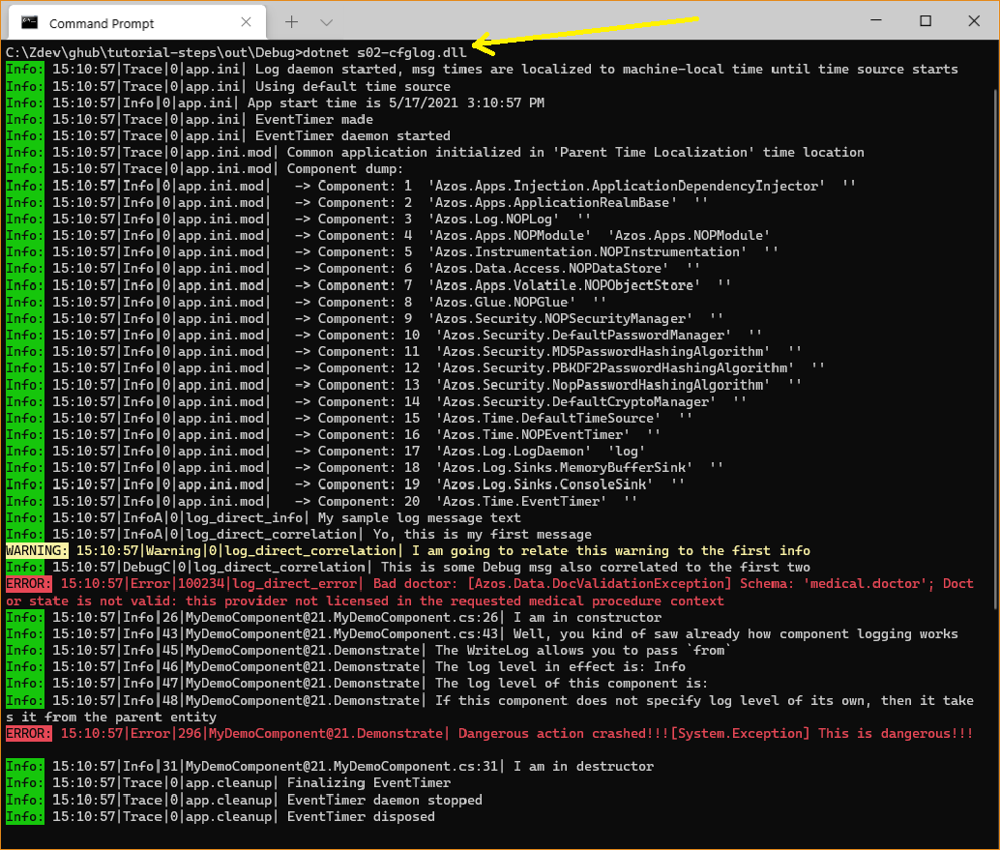

# Step 2 - App Configuration and Logging

We are going to build a program which outputs some messages via system logger. 

> We strongly recommend that you review [STEP 1 - Console CLI Application](/src/s01-console) first


When you run the application:
```csharp
./out/Debug/$ dotnet s02-cfglog.dll
```

We are running the app with its [Default Config file](s02-cflog.laconf) which specifies a console log 
sink, so all log messages will be shown in the console.

The following output is produced: 


Notice many "info" lines generated by the application host (chassis) which mounts all
of the services declared in a config. Notice the `app.ini` tag in console dump in the beginning
and then `app.cleanup` at the end.

A few messages in the middle are generated by the app code of this program.

The (Program.cs)[Program.cs] allocates app and then calls a few methods to demo logging:
```csharp
  using (var app = new AzosApplication(args))
  {
    log_direct_info(app);
    log_direct_correlation(app);
    log_direct_error(app);
    log_component(app);
    . . .
  }
```
The "direct" methods above are used just as an example of manual log message construction which 
you would **rarely (if ever) need in business applications** as most of the plumbing is going to 
be handled for you automatically by the "component loggers" as shown in `log_component` method.

The program declares a [`MyDemoComponent`](MyDemoComponent.cs) class which has no real
functionality but a `Demonstrate()` method which uses **component logger**.

> Application components are logical building blocks mounted in application container. Most services 
> (e.g. a logger) are components. Components provide a uniform architectural pattern for 
> business and system logic in a well-structured and manageable way. For example, components 
> can be managed at runtime (e.g. sent commands) and changed some parameters (e.g. log level) 
> without the need to stop/re-start your application.
 
 


